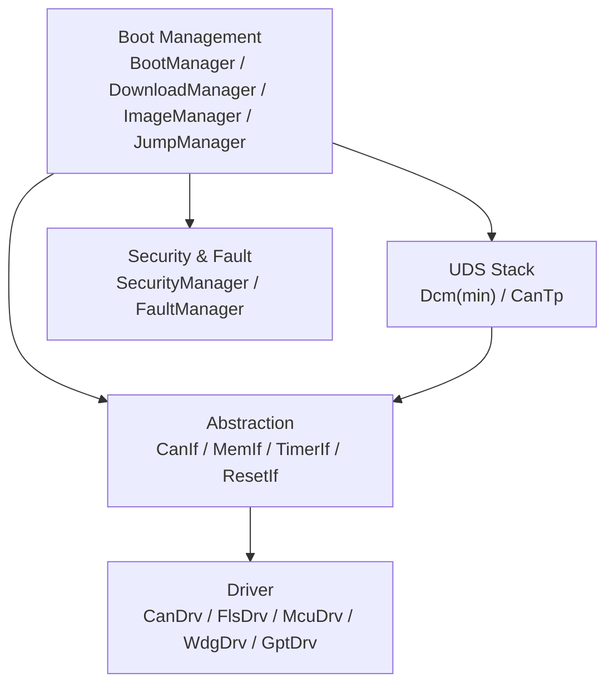
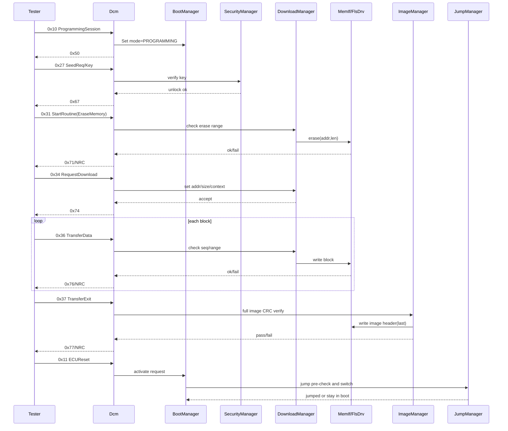
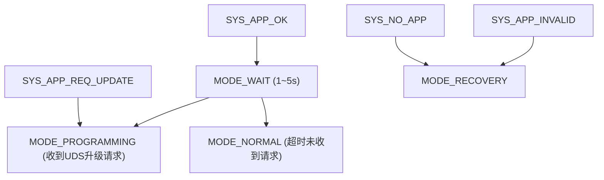
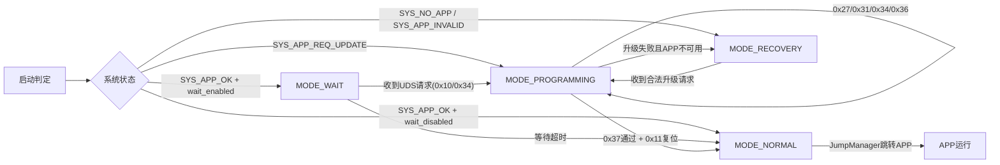

# S32K348 FBL 详细架构设计

## 1. 目标与范围
本设计用于 Flash Bootloader（FBL）落地实现，满足：
- 分层清晰：驱动层、抽象层、UDS 协议栈、Boot 管理、安全策略、防御性编码
- 仅保留固件升级最小闭环能力
- 明确刷写失败留驻 Boot 的路径

---

## 2. 分层架构

## 2.1 驱动层（Driver/MCAL）
职责：直接控制硬件外设，不含业务决策。
- `CanDrv`：CAN 收发中断、邮箱管理
- `FlsDrv`：Flash 擦除/写入/读回
- `McuDrv`：时钟、复位原因
- `WdgDrv`：看门狗
- `GptDrv`：1ms Tick

输出接口（示例）：
- `Fls_Erase(addr, len)`
- `Fls_Write(addr, data, len)`
- `Can_Write(pdu)`
- `Can_Read(pdu)`

## 2.2 抽象层（ECU Abstraction / HAL）
职责：屏蔽芯片差异，统一上层接口与错误码。
- `CanIf`：上层 PDU 映射
- `MemIf`：统一存储操作（擦/写/读）
- `TimerIf`：超时与节拍
- `ResetIf`：软件复位、启动原因

统一错误码：
- `FBL_OK`
- `FBL_E_PARAM`
- `FBL_E_RANGE`
- `FBL_E_SEQ`
- `FBL_E_TIMEOUT`
- `FBL_E_FLASH`
- `FBL_E_CRC`

## 2.3 UDS 协议栈
- `CanTp`：ISO-TP 分段重组（单帧、首帧、连续帧、流控帧）
- `Dcm(min)`：仅保留升级必须服务

### 必须服务集
- `0x10` DiagnosticSessionControl：进入 ProgrammingSession
- `0x27` SecurityAccess：种子密钥解锁
- `0x31` RoutineControl：擦除例程/校验例程
- `0x34` RequestDownload：声明下载地址与总长度
- `0x36` TransferData：分块传输写入
- `0x37` RequestTransferExit：传输收尾与整包校验
- `0x11` ECUReset：激活后复位
- `0x3E` TesterPresent：保活（建议）

> 说明：`Flash擦除指令`采用 `0x31`，推荐 RID：`EraseMemory`。

## 2.4 Boot 管理层
- `BootManager`：模式决策 + 状态机驱动
- `DownloadManager`：下载会话上下文、块序、地址窗口
- `ImageManager`：CRC/头信息/版本校验
- `JumpManager`：安全跳转 APP

## 2.5 安全与健壮性层
- `SecurityManager`：权限、尝试计数、延时锁定
- `FaultManager`：异常记录、恢复策略

---

## 3. 总体架构图


---

## 4. UDS 指令详细职责

## 4.1 `0x10` Programming Session
- 设置 `ProgrammingMode`
- 初始化下载上下文（清块序、清长度计数）
- 启动 S3 计时

失败返回：
- 条件不满足：`0x22`

## 4.2 `0x27` SecurityAccess
- 下发 Seed
- 校验 Key
- 失败计数 + 锁定延时

失败返回：
- Key 错误：`0x35`
- 次数超限：`0x36`
- 延时未到：`0x37`

## 4.3 `0x31` RoutineControl（擦除/校验）
### 子功能建议
- `startRoutine + RID_EraseMemory`：擦除升级目标区
- `startRoutine + RID_CheckMemory`：可选，预校验内存窗口

`RID_EraseMemory` 输入参数：
- 起始地址 `addr`
- 擦除长度 `len`

处理规则：
- 仅允许 APP 分区白名单
- 不允许覆盖 BL 区
- 地址与长度按扇区对齐
- 擦除失败立即置失败标志并返回错误

失败返回：
- 参数越界：`0x31`
- 擦除失败：`0x72`

## 4.4 `0x34` RequestDownload
- 保存 `download_addr`、`download_size`
- 初始化写指针、预期块序号
- 校验地址窗口、总长度、格式标识

失败返回：
- 参数错误：`0x13`
- 地址非法：`0x31`

## 4.5 `0x36` TransferData
- 校验块序号严格递增
- 校验本块长度与剩余长度
- 写入 Flash（仅允许窗口内）
- 累计 `received_size`

失败返回：
- 块序号错：`0x73`
- 长度/越界：`0x31`
- 写入失败：`0x72`

## 4.6 `0x37` RequestTransferExit
- 禁止“边写边信任”，统一在 0x37 后整包 CRC
- CRC 通过后再写 Header（最后一步，防断电）
- 置 `image_valid_pending_activate`

失败返回：
- CRC 失败：`0x72`

## 4.7 `0x11` ECUReset
- 清理升级临时标志
- 若 `image_valid_pending_activate` 为真，执行激活复位

## 4.8 固件头填充职责
固件头结构：
```c
typedef struct
{
    uint32_t magic;
    uint32_t firmware;
    uint32_t board;
    uint32_t version;
    uint32_t length;
    uint32_t crc32;
    uint32_t resv[10];
} app_header_t;
```

字段填充规则：
- APP 侧填充：`magic / firmware / board / version`
- APP 侧初始占位：`length = 0xFFFFFFFF`，`crc32 = 0xFFFFFFFF`
- FBL 侧回填（仅在 `0x37` 且整包校验通过后）：`length / crc32`

设计意图：
- 防断电：只有下载完整并校验通过后才写 `length/crc32`，避免“半包镜像被误判有效”。
- 防篡改：FBL 在回填前检查 `magic` 与 APP 预填字段有效性，回填后做读回校验。

---

## 5. 下载时序图


---

## 6. Boot 管理（4系统状态 + 4模式）

## 6.1 四种系统状态（System State）
- `SYS_NO_APP`：无 APP
- `SYS_APP_OK`：APP 正常
- `SYS_APP_INVALID`：APP 损坏/校验失败
- `SYS_APP_REQ_UPDATE`：请求升级（APP 标志或诊断触发）

## 6.2 四种 Boot 模式（Boot Mode）
- `MODE_NORMAL`：正常启动，直接跳转 APP
- `MODE_PROGRAMMING`：刷写模式，处理 UDS 升级链路
- `MODE_RECOVERY`：恢复模式，强制留在 Boot，只允许刷写恢复
- `MODE_WAIT`：等待窗口模式（上电等待 1~5s）

## 6.3 状态 -> 模式映射
- `SYS_APP_REQ_UPDATE` -> `MODE_PROGRAMMING`
- `SYS_APP_OK` -> `MODE_NORMAL`（或先 `MODE_WAIT`，超时后转 `MODE_NORMAL`）
- `SYS_NO_APP` -> `MODE_RECOVERY`
- `SYS_APP_INVALID` -> `MODE_RECOVERY`

## 6.4 映射与 Wait 决策图


## 6.5 运行状态机（按模式驱动）


## 6.6 决策规则
- `MODE_WAIT` 只在 `SYS_APP_OK` 下启用，用于“无 APP 配合也能刷写”的上电窗口。
- `MODE_RECOVERY` 下禁止跳转 APP，只允许 `0x10/0x27/0x31/0x34/0x36/0x37/0x11` 升级路径。
- 仅当 `0x37 CRC通过 + Header最后写成功 + 0x11复位` 才允许 `MODE_NORMAL` 跳转。
- Jump 前必须执行：中断关闭、VTOR 切换、MSP 装载、入口地址合法性检查。

---

## 7. 安全策略（必须项）

## 7.1 不信任 0x36 数据
- 长度检查
- 地址检查
- 边界保护（禁止 FBL 区域）

## 7.2 CRC 统一在 0x37 后执行
- 不允许边写边“直接信任通过”

## 7.3 Header 最后写
- 防止断电导致“看似有效但不完整”镜像

## 7.4 必须有失败路径
- 任意错误 -> 记录原因 -> 留在 Boot -> 等待重刷

## 7.5 安全访问控制
- 编程相关服务必须已解锁
- 失败次数与延时锁定

---

## 8. 防御性编码要求

## 8.1 输入校验
- 每个 SID 入口统一校验：`session/security/len/range/state`

## 8.2 状态机编码
- 单状态入口函数：`BootManager_Step()`
- 实现表驱动状态转移，非表项分支进入安全留驻

## 8.3 Flash 操作
- 每次 `erase/write` 必查返回值
- 关键元数据（下载进度、激活标志）使用冗余写策略

## 8.4 故障处理
- 捕获 HardFault/BusFault 记录到 `BL_META`
- 上电读取故障记录并决定是否禁跳

## 8.5 质量门禁
- 符合软件编码标准
- 静态分析无高危
- 单元测试覆盖：块序错误、越界、CRC失败、擦除失败、跳转拒绝

## 9. 结论
该版本设计已覆盖已有源码，并做了防御性编码增强和部分重构设计。

