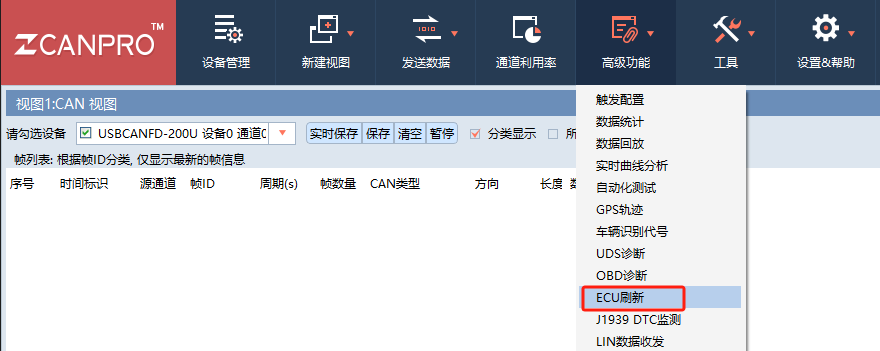
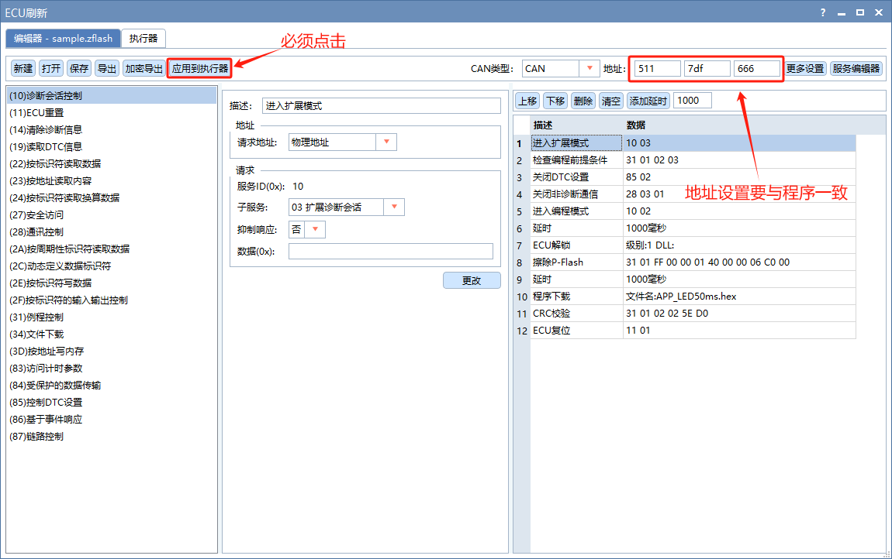
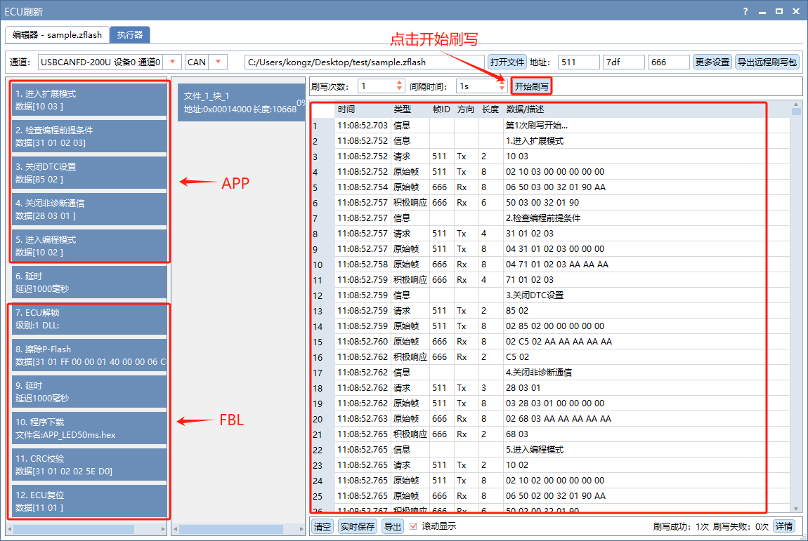
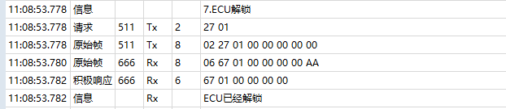
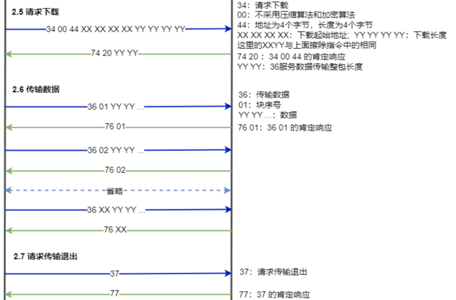

### 上位机
* 诊断刷写需要上位机的配合，我们选择使用周立功的 ZCANPRO 工具软件作为上位机。

  

  
* 由于我们程序中目前 CAN 只能接收到 ID 为 0x511 的报文（CAN驱动太烂，懒得改），所以【请求地址】全部设置为【物理地址】，这样的话所有诊断请求报文的 ID 都是 0x511 了。

  
* 上图中，步骤1~步骤5的响应处理应在 APP 中实现，步骤7~步骤12应在 FBL 中实现。
* 上图中的步骤配置文件见：[sample.zflash](./sample.zflash)，可借鉴使用。

### APP代码实现
* 先来说 APP，其中步骤1~步骤4，由于当前工程并非是实际开发项目，所以仅要求 APP 能回复正响应即可，至于响应处理逻辑暂时不做实现。具体可根据右侧的数据窗口错误提示去 “UDSLogic” 目录下修改对应的代码。
* 步骤5比较关键，程序在此处从 APP 跳转到 FBL，但是为了防止程序从 FBL 中又立马跳回 APP，需要设置一个升级标志，使得程序能在 FBL 中逗留，直到升级工作完成，再清除该标志，跳回 APP。
* 我们把该标志存放在 D-Flash 区域中，D-Flash 区域起始地址是 0x10000000; 大小是: 0x10000。
* 为此，在 SID10_SessionControl.c 中添加如下定义代码：
  ```c
  union UpdatedateFlagType
  {
  	uint16_t 	updateFlag;
  	uint8_t 	updateFlagArr[8];
  };
  static union UpdatedateFlagType UF;
  ```
* 在 10 服务处理函数中的编程会话下设置升级标志，并存储到 D-Flash 的 0x10000000 地址处。需要注意的是，Flash 有个特性，那就是写入前必须先擦除，原因是数据写入时，Flash 只能将每个 bit 从 1 变为 0，不能将 0 变为 1，而擦除动作就是将所有 bit 都变为 1。同时，D-Flash 的最小写入单位是 8 字节，擦除最小单位是 2K。
* 在设置完成升级标志并存储成功之后，程序需要跳转到 FBL，跳转方式可通过调用 SystemSoftwareReset() 函数复位 MCU 芯片实现。复位前最好延时一段时间，确保复位前响应完成和升级标志写入成功。
  ```c
  void service_10_SessionControl(const uint8_t* msg_buf, uint16_t msg_dlc)
  {
    ...
    switch (subfunction)
  	{
      ...
      case UDS_SESSION_PROG:		// 02 编程会话
        ...      
        EraseFlash(0x10000000, 2048);
        UF.updateFlag = 0x55AA;
        WriteFlash(0x10000000, sizeof(UF), UF.updateFlagArr);
        {volatile uint32_t delay = 999999; while(delay--);}
        SystemSoftwareReset(); // 复位 MCU
        break;
        ...
  	}
  }
  ```
* 注意：在从 APP 跳转到 FBL 时，上位机需要基于一定的时间等待 FBL 初始化完成，否则程序可能来不及响应。

### 踩了个坑，坑死人
* 踩了个坑，坑死人，可能是编译器优化的坑。在仿真调试升级标志是否写入成功时发现。
* 错误写法：
  ```c
  pUF = (union UpdatedateFlagType *)0x10000000;
  if(0x55AA == pUF->updateFlag)
  {
    ...
  }
  ```
* 正确写法：
  ```c
  pUF = (union UpdatedateFlagType *)0x10000000;
  UF.updateFlag = pUF->updateFlag;
  if(0x55AA == UF.updateFlag)
  {

  }
  ```
* 错误的写法是直接使用指针变量做判断，正确的写法是先将指针变量赋值给另一个变量。直接使用指针变量做判断的话程序可能不会实时读取 Flash 中的最新数据，而是使用缓存中的数据。而多了一个赋值动作后，程序就会每次都从 Flash 中获取最新数据了。
* 当然，这样的做法存在风险，这依赖于编译器优化，正确做法是老老实实的调用 flash read 库函数吧。有些芯片会有专门对应的 nocatch 区域，也可以直接读取 nocatch 区。

### FBL中检测升级标志
* 程序从 APP 复位后进入到 FBL，在 FBL 中需要检测升级标志，如果升级标志被设置，则需要留在 FBL 中运行，等待接收升级包数据。如果升级标志没有被设置，则需要跳转到 APP 运行。
* 代码实现如下：
  ```c
  int main(void)
  {
    ... // 初始化
    for (;;)
    {
      ... // 其它主循环任务处理

      // 读取 D-Flash 中 0x10000000 处的升级标志
      pUF = (union UpdatedateFlagType *)0x10000000;
      UF.updateFlag = pUF->updateFlag;
      if(0x55AA != UF.updateFlag)
      {
        static uint32_t jumpDelay= 0;
        if(jumpDelay++ > 100) // 延时 100ms 跳转 APP
        {
          LPUART1_transmit_string("Jump to APP.\r\n");
          // __asm("bl 0x00014000"); // APP 程序的代码段(.text)起始地址是 0x00014410，并不是 0x00014000。
          __asm("bl 0x00014410");
        }
      }
    }
  }
  ```

### 编程会话
* 程序进入 FBL 后会重新初始化，而 UDS 初始化后会处在默认会话模式的，而上位机不会再次发送 10 02 命令通知进入编程会话模式，此时我们可以在 UDS 初始化时调用 set_current_session(UDS_SESSION_PROG) 进入编程会话模式。 
  ```c
  void uds_init(void)
  {
      service_init();
      set_current_session(UDS_SESSION_PROG);
  }
  ```

### 安全访问解锁
* 步骤7：ECU解锁(27服务)。
* 因为要制作上位机需要的安全算法 dll 库，比较麻烦，这里先不实现，后面再完善。
* 实测在没有安全算法 dll 库的情况下上位机依旧可以向下执行。如果不能执行的话可以先删除这一步，继续接下来的核心升级工作。
  
  
* 虽然上位机可以跳过 27 服务，但是 FBL 在接下来的升级工作中，会检测是否处于解锁状态，为了能把继续进行下去，这里在 “service_cfg.c” 文件中把升级相关的 34、36、37 服务安全访问等级改为 UDS_SA_NON。后面完善 27 解锁功能后恢复。
* 在 “service_cfg.c” 中将安全访问等级改为 UDS_SA_NON
  ```c
  // 服务配置表
  const uds_service_t uds_service_list[SID_NUM]  =
  {
      /* SID   服务处理函数                            长度是否合法            是否支持默认会话
                                                                                     是否支持编程会话
                                                                                            是否支持扩展会话
                                                                                                   是否支持功能寻址
                                                                                                          是否支持肯定响应抑制
                                                                                                                 安全访问等级 */
      ...
      {SID_34, service_34_RequestDownload,            service_34_check_len,  FALSE,  TRUE,  FALSE, FALSE, FALSE, UDS_SA_NON},
      {SID_36, service_36_TransferData,               service_36_check_len,  FALSE,  TRUE,  FALSE, FALSE, FALSE, UDS_SA_NON},
      {SID_37, service_37_RequestTransferExit,        service_37_check_len,  FALSE,  TRUE,  FALSE, FALSE, FALSE, UDS_SA_NON},
  };
  ```

### 擦除 Flash
* 步骤8，擦除 APP 所在的 Flash 区域，对应 31 服务中的 01 子服务，rid 为 0xFF00.

  
* 当前芯片的 Flash 的特性是一次性擦除最小单位是 4K，而上位机发送过来的 eraseSize 可能不是 4k 的整数倍，这里需要注意一下。现在为了简单，直接固定擦除整个 APP 区域。后面有时间再优化。
  ```c
  if(0xFF00 == rid) // 擦除 Flash
  {
    eraseStartAddr = msg_buf[4] << 24 | msg_buf[5] << 16 | msg_buf[6] << 8 | msg_buf[7];
    eraseSize = msg_buf[8] << 24 | msg_buf[9] << 16 | msg_buf[10] << 8 | msg_buf[11];
    // 注意：擦除最小单位是 4K，这里暂时写死，擦除整个 APP flash 区域
    // EraseFlash(eraseStartAddr, eraseSize);
    EraseFlash(0x00014000, 0x0006C000);
  }
  ```

### 程序下载
* 步骤10，程序下载，对应 34、36、37 服务。
  
  
* 34 服务请求下载，FBL 需要判断上位机发送过来的下载起始地址和长度是否正确，如果不正确，需要回复特定的否定响应。现在先简单处理，直接回复肯定响应。
  ```c
  void service_34_RequestDownload(const uint8_t* msg_buf, uint16_t msg_dlc)
  {
  	uint8_t rsp_buf[8];
  
  	// 这里需要解析 34 服务报文
  
  	rsp_buf[0] = USD_GET_POSITIVE_RSP(SID_34);
  	rsp_buf[1] = 0x20;
  	rsp_buf[2] = (uint8_t)(TOTAL_LEN_36 >> 8);
  	rsp_buf[3] = (uint8_t)(TOTAL_LEN_36 >> 0);
  	uds_positive_rsp(rsp_buf, 4);
  }
  ```
* 36 服务，传输数据，这一步才是真正的将升级包写入到 Flash 中。目前先简单处理，不做容错机制，直接写入。
  ```c
  void service_36_TransferData(const uint8_t* msg_buf, uint16_t msg_dlc)
  {
  	uint8_t rsp_buf[8];
  	uint8_t bn = 0;
  
  	bn = msg_buf[1];
  
  	static uint32_t wrIdx = 0;
  	WriteFlash(0x00014000 + wrIdx*512, 512, &msg_buf[2]);
  	wrIdx++;
  
  	rsp_buf[0] = USD_GET_POSITIVE_RSP(SID_36);
  	rsp_buf[1] = bn;
  	uds_positive_rsp(rsp_buf, 2);
  }
  ```
* 37 服务，数据传输完成，请求退出，这一步没啥好说的，直接回复正响应即可。
  ```c
  void service_37_RequestTransferExit(const uint8_t* msg_buf,   uint16_t msg_dlc)
  {
  	uint8_t rsp_buf[8];
  
  	rsp_buf[0] = USD_GET_POSITIVE_RSP(SID_37);
  	uds_positive_rsp(rsp_buf, 1);
  }
  ```

### CRC校验
* 步骤11，CRC校验，对应 31 服务中的 01 子服务，rid 为 0x0202。这一步是为了验证整个写入的升级包数据是否正确的，目前先不做处理，直接回复正响应。
  ```c
  if(0x0202 == rid) // CRC 校验
  {
    uds_positive_rsp (rsp_buf, 4);
  }
  ```

### ECU复位
* 步骤12，ECU复位，对应 11 服务，这一步需要做的工作是取消升级标志，回复肯定响应然后复位芯片。
  ```c
  void service_11_EcuReset(const uint8_t* msg_buf, uint16_t msg_dlc)
  {
    ...
    switch (subfunction)
    {
      case UDS_RESET_HARD: // 11 01  	
        // 取消升级标志		
        EraseFlash(0x10000000, 2048); 
        UF.updateFlag = 0x0000;
        WriteFlash(0x10000000, sizeof(UF), UF.updateFlagArr);

        rsp_buf[0] = USD_GET_POSITIVE_RSP(SID_11);
        rsp_buf[1] = UDS_RESET_HARD;
        uds_positive_rsp(rsp_buf, 2);

        {volatile uint32_t delay = 999999; while(delay--);}
        SystemSoftwareReset(); // 复位 MCU
        break;
      ...
    }
  }
  ```