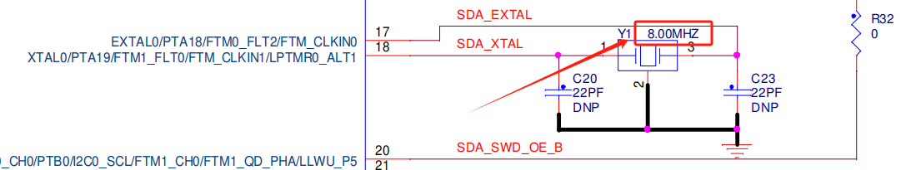
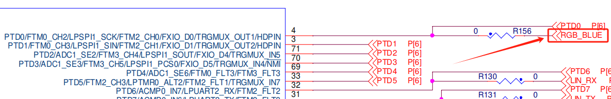
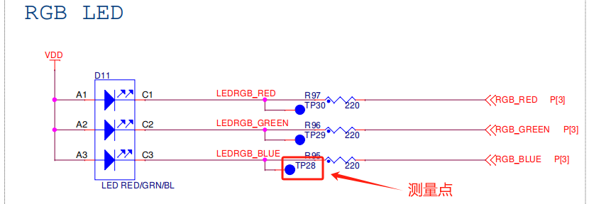
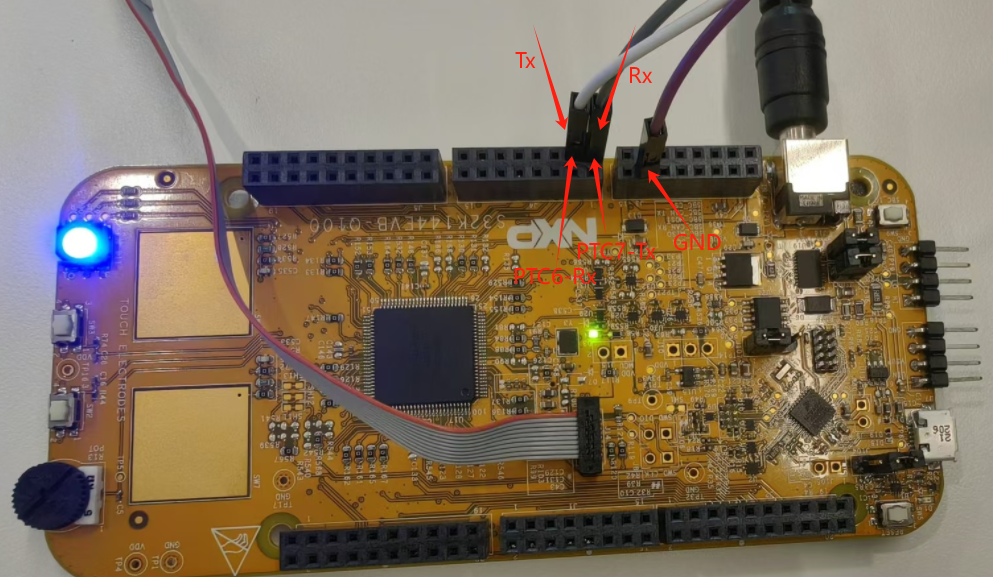
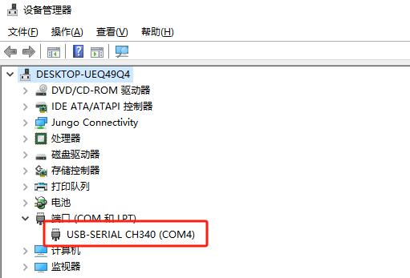
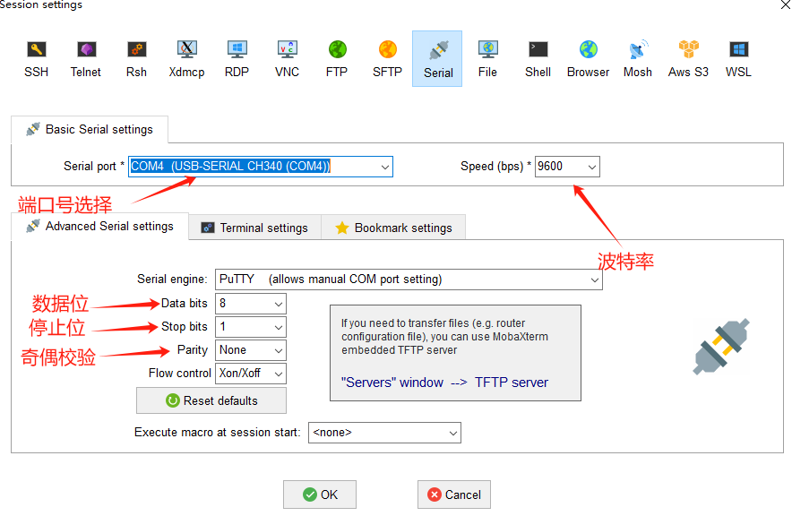
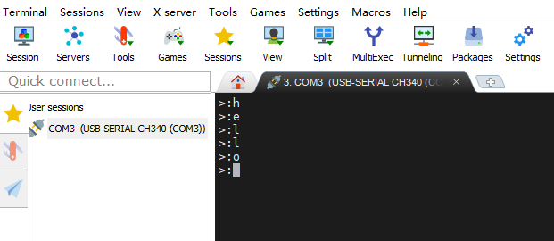

### Clock
* 在上节中我们知道，Base 工程是基于 Clock 时钟 example 例程的。
* 首先保证例程跟实际硬件一致，从代码中我们可以知道，时钟源为 8M，对照一下原理图和实物图，保证时钟源晶振选择与程序一致，如果不一致，那么可能后面的所有外设驱动都有可能出现问题。

  

### GPIO
* 在 Base 例程中，初始化了一路 GPIO 用于控制 LED 灯，在 PORT_init() 函数中找到这个 LED 灯找一下对应的控制引脚为 PTD0，在原理图中找到这个引脚对应的测量点为 TP28，方便以后测量调试使用。

  

  
* 以下为 PTD0 引脚的控制代码
  ```c
  PTD->PTOR |= 1<<0;                	// 翻转
  PTD->PDOR |= 1<<0;					// 拉高
  PTD->PDOR &= ~(1<<0);				// 拉低
  ```

### 定时器
* 在 Base 例程中，初始化了一个 1 秒中定时器，1 秒钟不常用，最常用的是 1ms 定时器，在 LPIT0_init() 函数中，按照如下方式改一下代码即可。 
  ```c
  // LPIT0->TMR[0].TVAL = 40000000;
  LPIT0->TMR[0].TVAL = 40000;     	  
  ```
* 主循环稍微修改一下，主要是把 while 死等(while(0 == (LPIT0->MSR & LPIT_MSR_TIF0_MASK)))定时器延时改为 if 等待。
  ```c
  for (;;)
  {
      /* Toggle output to LED every LPIT0 timeout */
      if(0 != (LPIT0->MSR & LPIT_MSR_TIF0_MASK)) // 1ms
      {
          static int cnt = 0;
          if(cnt++ >= 200)						
          {
              cnt = 0;
              PTD->PTOR |= 1<<0;                	// 200ms 翻转
          }
          LPIT0->MSR |= LPIT_MSR_TIF0_MASK; /* Clear LPIT0 timer flag 0 */
      }
  }
  ```

### 串口
* 参考 [烧录仿真初体验](./烧录仿真初体验.md) 中的【新建工程】，从 example 中新建一个 uart 串口例程。
* 将串口例程中的串口驱动代码(LPUART.c 和 LPUART.h) 复制到当前工程(S32K144_Proj)中。这样我们当前工程就有了串口驱动代码。
* 光有串口驱动代码(LPUART.c 和 LPUART.h)是不够的，注意串口例程中的 PORT_init() 函数中的串口 Tx、Rx 引脚初始化的代码也要复制到当前工程(S32K144_Proj)中 
  ```c
  /*!
   * Pins definitions
   * ===================================================
   *
   * Pin number        | Function
   * ----------------- |------------------
   * PTC6              | UART1 TX
   * PTC7              | UART1 RX
   */
  PCC->PCCn[PCC_PORTC_INDEX ]|=PCC_PCCn_CGC_MASK; /* Enable clock for PORTC   */
  PORTC->PCR[6]|=PORT_PCR_MUX(2);	/* Port C6: MUX = ALT2, UART1 TX */
  PORTC->PCR[7]|=PORT_PCR_MUX(2);   /* Port C7: MUX = ALT2, UART1 RX */
  ```
* 最后初始化串口
  ```c
  LPUART1_init(); /* Initialize LPUART: 9600 baud, 1 stop bit, 8 bit format, no parity */
  ```
* 添加一点调试代码测试一下串口是否 OK
  ```c
  for (;;)
  {
		LPUART1_transmit_string(">:");
		LPUART1_receive_and_echo_char(); // echo received char back
  }
  ```

### 串口助手
* 串口驱动代码实现完成之后，接下来使用串口工具测试一下串口功能是否正常。
* 第一步，使用 USB 转串口工具连接开发板。如下图所示。**注意：PORT_init() 函数中 Tx、Rx 引脚注释写反了，原理图上是正确的**。
  
* 在使用串口工具软件之前，要检查串口【设备管理器】中串口驱动是否 OK，如果串口驱动异常，可安装 CH340 驱动，具体可网上搜索解决。

  
* 不同的串口助手软件设置可能有所差异，但是端口号选择、波特率、数据位、停止位、奇偶校验位这几个参数需要设置，具体设置值跟 uart 驱动程序一致即可。

  
* 串口代码测试结果如下，成功原样返回输入的字符。
  
  