### 引言
* 接下来我们将 FBL和 APP 分离，借助一些工具体验一下从 FBL 跳转到 APP 这个过程。

### FBL与APP分离
* 怎么分离？
* 这还不简单，直接 copy 一份，两个工程一个叫 FBL，一个叫 APP 不就行了。
* 简单的 Copy 肯定是不行的，RAM 和 ROM(Flash) 资源也需考虑拆分。
* RAM 也可以不拆分，FBL 与 APP 共用同一片 RAM 区间。运行到 APP 后就把 FBL 的 RAM 数据覆盖掉，一般来讲不会有啥问题。当然了，如果 FBL 中有啥数据需要传递给 APP 的，那么也可以单独划出一部分 RAM 出来，不过目前暂时还不需要研究，直接覆盖使用即可。
* ROM(Flash) 划分是必须的，FBL 与 APP 程序在 Flash 中存储，绝对不可以交叉重叠。
* 查找一下芯片手册，S32K144 的程序 Flash（P-Flash）一共 512K，地址从 0x-0x80000,我们先简单划分一下，前 80K 为 FBL，剩余空间给 APP。空间的划分是人为的，实际开发中可根据 FBL 和 APP 程序的大小调整。

  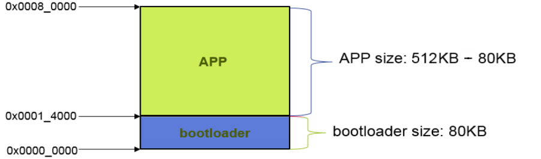
* 修改程序的链接地址，一般是修改工程中的链接脚本，当然有的也可通过 IDE 修改，不过本质上还是修改链接脚本，本工程我们就通过修改链接脚本的方式修改程序的链接地址。
* 链接脚本一般后缀为 “.ld”，在本工程中通过搜索/查找，发现链接脚本名为 “S32K1xx_flash.ld”。
* 先改一下 FBL 中的链接脚本，使得其程序范围：[0-0x00014000) (P-Flash前80K)
  ```
  MEMORY
  {
    /* Flash */
    /* m_interrupts          (RX)  : ORIGIN = 0x00000000, LENGTH = 0x00000400 */
    /* m_flash_config        (RX)  : ORIGIN = 0x00000400, LENGTH = 0x00000010 */
    /* m_text                (RX)  : ORIGIN = 0x00000410, LENGTH = 0x0007FBF0 */
    /* FBL: [0x00000000 - 0x00014000); APP: [0x00014000 - 0x00080000) */
    m_interrupts          (RX)  : ORIGIN = 0x00000000, LENGTH = 0x00000400
    m_flash_config        (RX)  : ORIGIN = 0x00000400, LENGTH = 0x00000010
    m_text                (RX)  : ORIGIN = 0x00000410, LENGTH = 0x00013BF0
  
    ...
  }
  ```
* 再修改一下 APP 的链接脚本，使得其程序范围：[0x00014000-0x00080000) (P-Flash剩余空间)
  ```
  MEMORY
  {
    /* Flash */
    /* m_interrupts          (RX)  : ORIGIN = 0x00000000, LENGTH = 0x00000400 */
    /* m_flash_config        (RX)  : ORIGIN = 0x00000400, LENGTH = 0x00000010 */
    /* m_text                (RX)  : ORIGIN = 0x00000410, LENGTH = 0x0007FBF0 */
    /* FBL: [0x00000000 - 0x00014000); APP: [0x00014000 - 0x00080000) */
    m_interrupts          (RX)  : ORIGIN = 0x00014000, LENGTH = 0x00000400
    m_flash_config        (RX)  : ORIGIN = 0x00014400, LENGTH = 0x00000010
    m_text                (RX)  : ORIGIN = 0x00014410, LENGTH = 0x0006BBF0
  
    ...
  }
  ```
* 修改链接脚本后，分别再次编译仿真一下 FBL和 APP 程序，确保其还能正常运行。

### 修改代码
* 改动 FBL 代码，增加跳转到 APP 功能
  ```c
  static int jumpToAppCnt = 0;
  if(jumpToAppCnt++ >= 5000)						
  {
			// 5s 后跳转到 APP
      LPUART1_transmit_string("Jump to APP.\r\n");
      __asm("bl 0x00014000");
  }
  ```
* **注意**：尽量不要在中断中执行跳转指令，程序在 FBL 中处在中断状态下跳转到 APP， APP 的 Reset_Handler 初始化并不能复位中断状态，造成 APP 无法再次进入中断。表现为 APP 中断全部失效。
* 稍微修改一下 APP 代码，比如修改 LED 闪烁翻转时间为 1秒，FBL 的 LED 闪烁翻转时间为 200ms，通过 LED 闪烁频率来观测是否成功从 FBL 跳转到 APP。
  ```c
  static int cnt = 0;
  if(cnt++ >= 1000)						
  {
      cnt = 0;
      PTD->PTOR |= 1<<0;                	// 1000ms 翻转
  }
  LPIT0->MSR |= LPIT_MSR_TIF0_MASK; /* Clear LPIT0 timer flag 0 */
  ```

### hex、bin、s19文件的生成
* 程序的烧写文件有很多种格式，比如 bin、hex、s19 等，通过相应的刷写工具将程序烧写文件刷写到控制器的 ROM 或 Flash 中，就可以实现控制器软件的更新。
* IDE 一般都会提供这些程序文件的生成方式，比如 S32DS 生成 bin、hex、s19 方式如下。如果 IDE 不提供的话，一些工具也是可以实现互转的，因为这些文件的格式是固定的，可自行查找。

  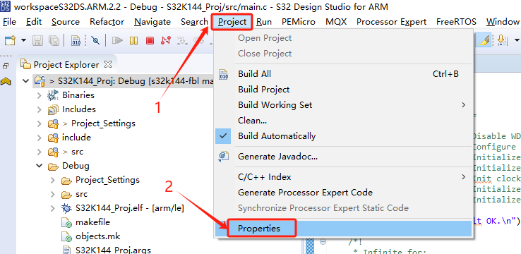

  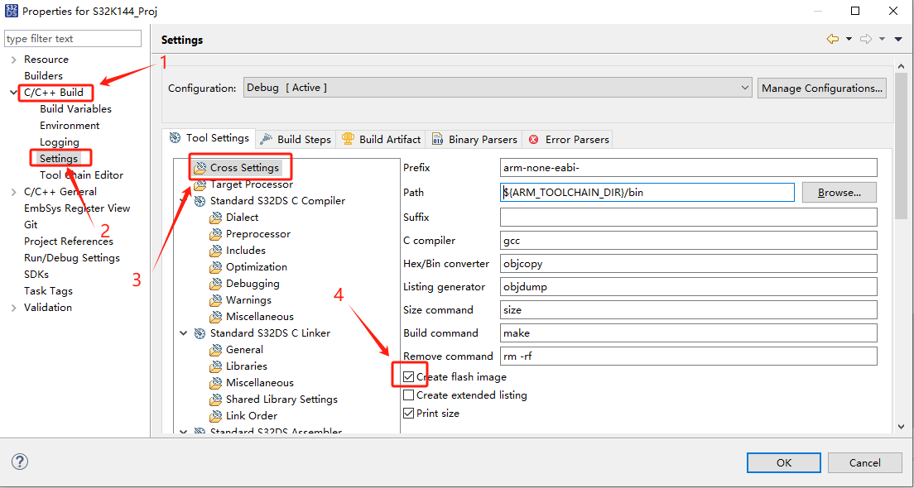

  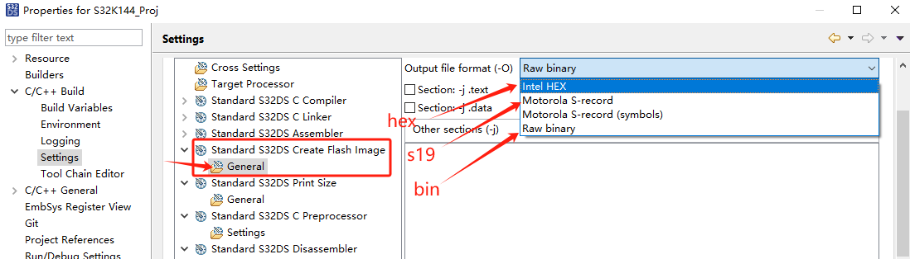
* 选择想要的格式后再次编译即可生成对应的文件。
* 其中，srec 文件就是 s19 文件，生成的 .srec 文件直接改为 .s19 也可以。

### 合并程序
* 按照上面的方式，我们让 FBL 和 APP 分别生成 hex 程序文件。将生成的 hex 文件分别重命名为 “FBL.hex” 和 “APP.hex”，重命名只是为了方便区分罢了。
* 接下来利用 “Hexview” 这个工具将 “FBL.hex” 和 “APP.hex” 两个 hex 文件合并成一个 hex 文件。
* 首先，打开 “Hexview”，将 “APP.hex” 拖拽到到 “Hexview”中，可以看到 APP 程序的起始地址为 0x00014000，显示如下：
  
  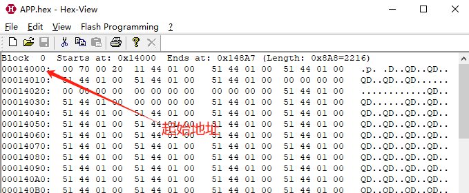
* 然后，将 “FBL.hex” 文件合并进来。具体操作如下：

  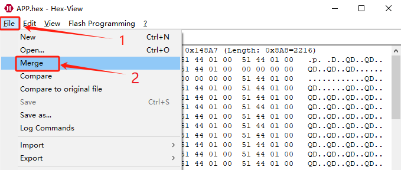
  
  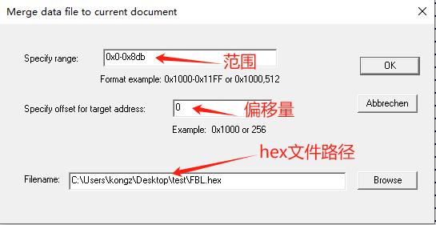

  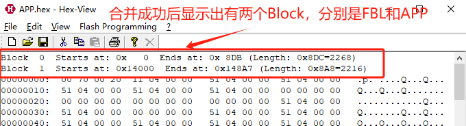
* 合并成功后，将合并后的文件另存为 “ALL.hex”

  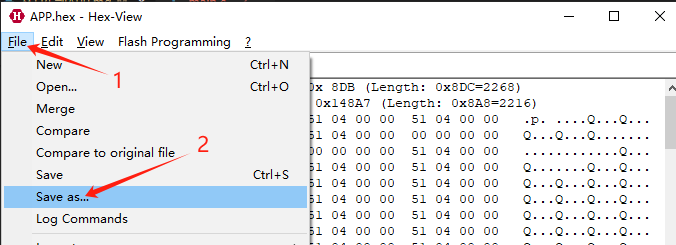

### 烧录hex
* 在得到合并后的程序文件 “ALL.hex” 后，按照如下方式，利用 S32DS 将其烧录到芯片中。

  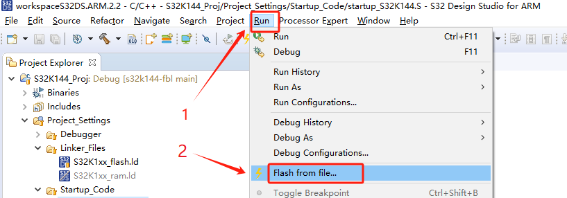

  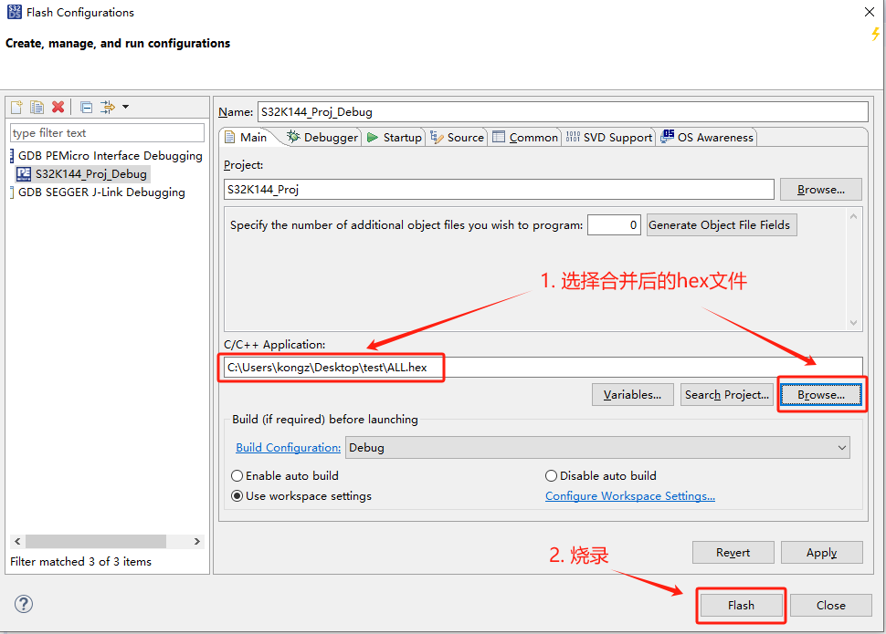

### 异常问题解决
* 烧录成功后，LED 等快速闪烁 5s 后便不在闪烁，并没有按照 APP 程序中预期的 1s 慢闪烁，同时通过串口观测到如下打印信息：
  ```
  FBL Init OK.
  Jump to APP.
  ```
* 这说明程序仅成功运行了 FBL，APP 并未运行。
* 经过反复尝试摸索后，终于找到了问题所在，从链接脚本中我们可以看到，程序代码段(.text)的起始地址是 0x00014410, 并不是 0x00014000。

  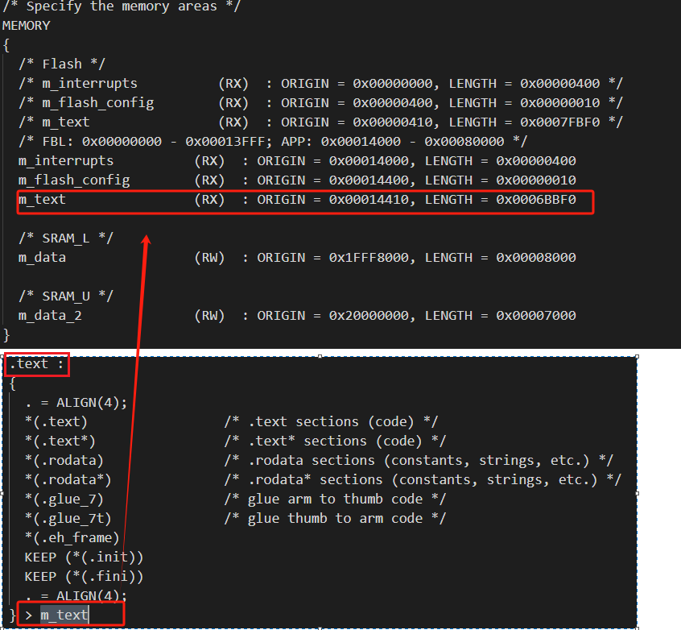
* 于是，FBL 代码改动如下：
  ```c
  LPUART1_transmit_string("Jump to APP.\r\n");
  // __asm("bl 0x00014000");
  __asm("bl 0x00014410");
  ```
* 代码修改完成后，按照上面的步骤，重新编译、合并 hex，烧录后再次运行，LED 灯快速闪烁 5s 后变为慢闪烁，同时串口打印如下信息。说明 程序成功从 FBL 跳转到了 APP。
  ```
  FBL Init OK.
  Jump to APP.
  APP Init OK.
  ```