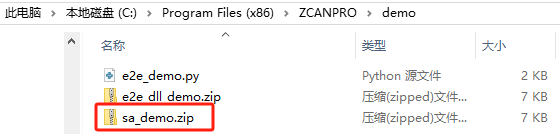
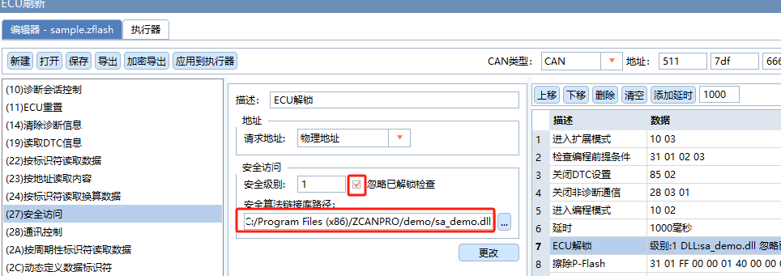
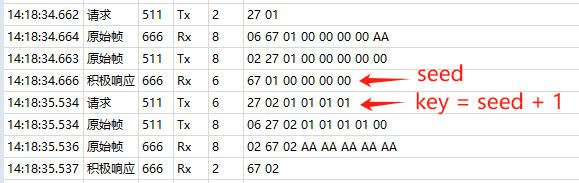
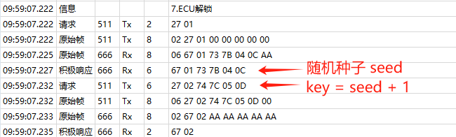

### 体验解锁过程
* ZCANPRO 在进行 ECU 解锁的时候，需要添加 dll 文件。在该软件的安装目录下提供了 Demo 文件。 

  
* 解压缩后得到 dll 库 sa_demo.dll 以及源文件 sa.cpp 和 dll.h
* dll.h 不需要任何改动，sa.cpp 根据项目需求改动，以下代码仅为例子。
  ```cpp
  extern "C" int ZLGKey( const unsigned char* iSeedArray
  					  , unsigned short iSeedArraySize
  					  , unsigned int iSecurityLevel
  					  , const char* iVariant
  					  , unsigned char* iKeyArray
  					  , unsigned short* iKeyArraySize )
  {
  	// 以下代码仅为例子, 具体算法自定义实现
  	if (0 == iSeedArray || 0 == iKeyArray) return -1;
  	for (unsigned short i = 0; i < iSeedArraySize; ++i)
  	{
  		iKeyArray[i] = iSeedArray[i] + 1;
  	}
  	*iKeyArraySize = iSeedArraySize;
  	return 0;
  }
  ```
* 我们先使用 Demo 中提供的 sa_demo.dll 文件体验一下解锁过程。

  

  

### 制作 dll 文件
* 实际项目中，这个 dll 别人并不一定都会提供，有时也需要自己制作实现。
* 我们可以利用 MinGW 软件制作 dll 文件。 
* 安装 MinGW，详见: https://gitee.com/openes/mingw
* MinGW 安装完成后，在 Windows 命令行下执行如下命令即可生成 dll 链接文件
  ```
  g++ sa.cpp -shared -o sa.dll
  ```

### 随机种子
* 上面案例中 27 01 请求得到的种子数值全是 0，实际开发中需要的是随机数。
* 在 C 语言中，我们使用 stdlib.h 头文件中的 srand() 和 rand() 函数来生成随机数。
* srand() 函数初始化随机数发生器（俗称种子），在实际开发中，我们可以使用系统 tick，如果没有的话，可以自定义一个变量，放到主循环中累加即可。
* 当前工程太简陋了，找不到系统 tick，所以随便定义了一个变量 mainLoopCnt，并将其放到 main 主循环中累加。用 mainLoopCnt 作为 srand() 函数的种子。
  ```c
  volatile uint32_t mainLoopCnt;
  static uint8_t rand_u8(void)
  {
  	static uint32_t tmp = 666;
  	srand(mainLoopCnt + tmp++);
  	return (rand() % 0xFF);
  }
  ```
* 在回复随机种子之后，接着上位机会根据随机种子借助 dll 算法计算出 key 并发送回 FBL，等待 FBL 判断 key 是否正确，此时我们在 FBL 中要判断上位机发送过来的 key 值与自己计算的 key 值是否一致，如果一致，则刷写流程可继续执行，如果不一致，则回复对应的否定响应码。
* 以下 FBL 中的代码对应上面 Demo 中的 dll 算法。
  ```c
  int uds_security_access(uint8_t* key_buf, uint8_t* seed_buf)
  {
  	uint16_t i = 0;
  	for(i = 0; i < UDS_SEED_LENGTH; i++)
  	{
  		if(key_buf[i] != seed_buf[i] + 1) // 判断 key 是否等于 seed + 1
  			return -1;
  	}
  	return 0;
  }
  ```
* 修改完成后，运行结果如下图所示
  
  