### 引言
* 首先开发工作开始之前，根据芯片型号（S32K144）去 NXP 官网查找相关资料，比如芯片手册、集成开发环境（IDE）、Demo 例程代码等。
* 开发所需的工具资料等本人已上传到网盘：https://pan.baidu.com/s/107dbfEvc0ljqpCQt8hkrhA?pwd=4r2w 

### 硬件平台
* 开发板为 NXP 官方提供的 “S32K144-Q100通用评估板”。实物如下图所示：
  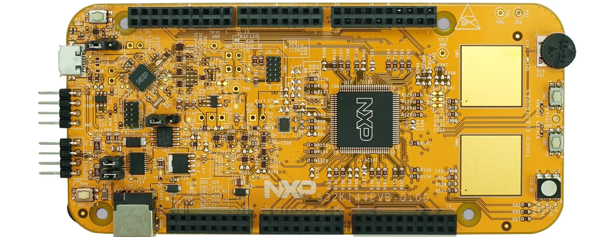

### S32DS 安装
* NXP 为 S32K 系列芯片提供了 “S32 Design Studio” 集成开发环境（IDE），用于编译、仿真、调试。
* 选择对应的 IDE 版本，注意必须注册登录后才能下载 IDE。这里以 Windows 环境为例，下载完成后双击 “S32DS_ARM_Win32_v2.2.exe” 进行 IDE 安装。

  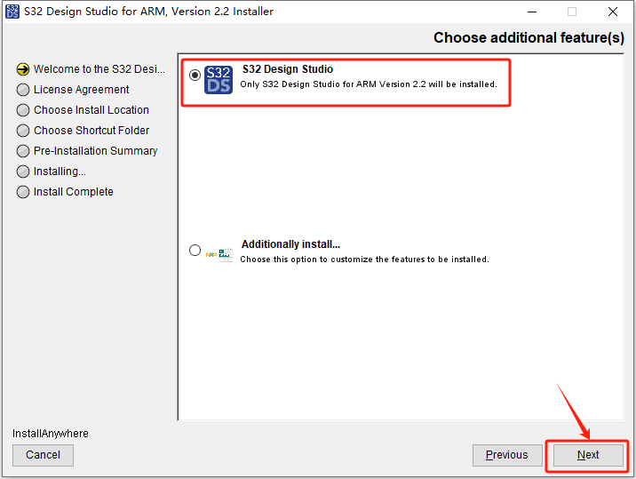

  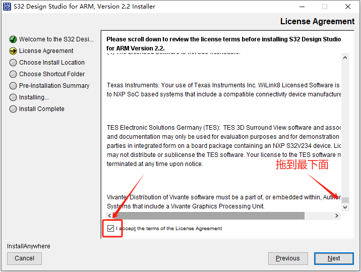

  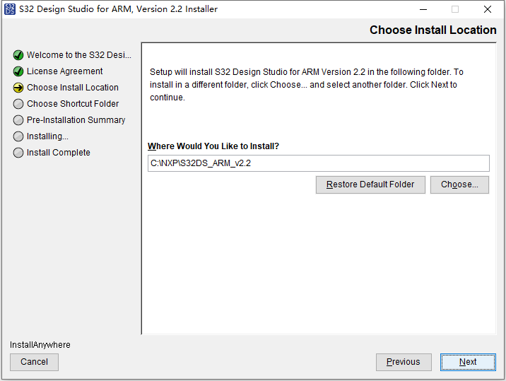

  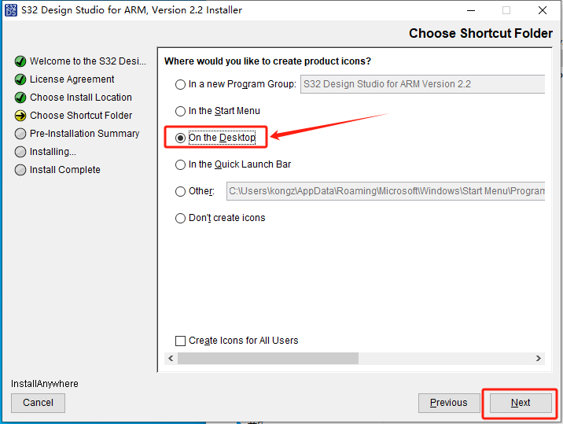

  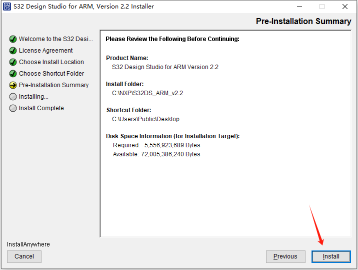

  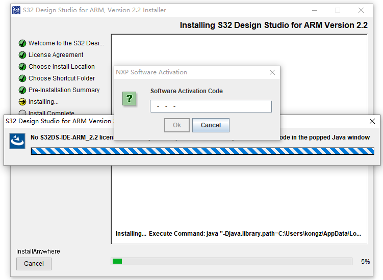
* 激活码会发送到你注册账号用的邮箱中: 8E50-DD7C-7253-88C5

  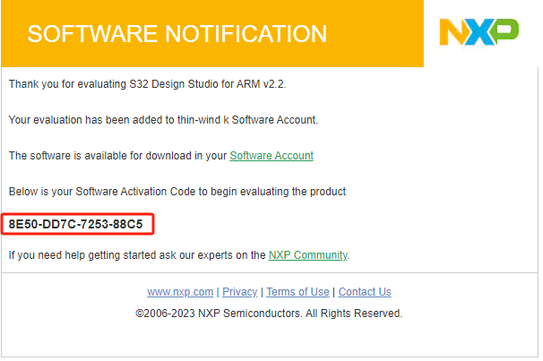
* 填入激活码后点击“OK”，弹出如下窗口，选择“Online”激活方式。

  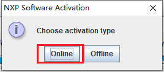

  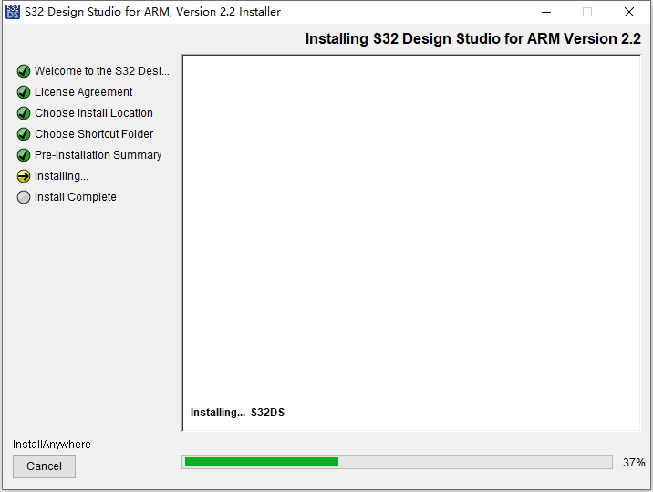

  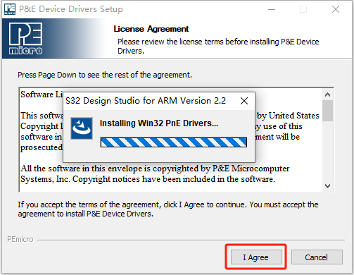

  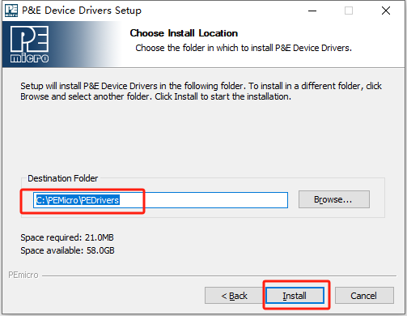

  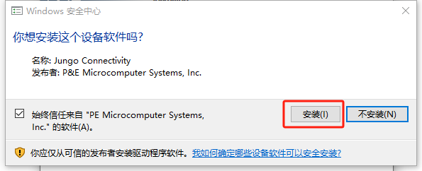

  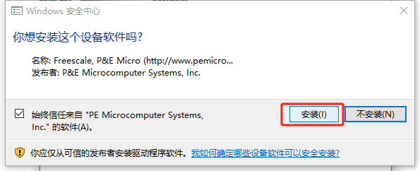

  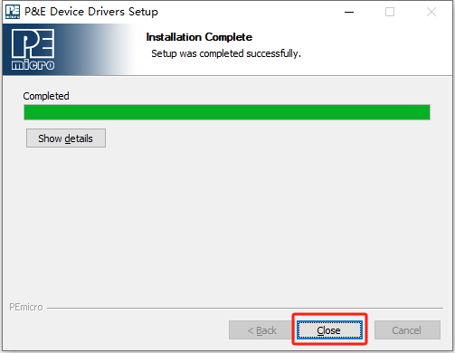

  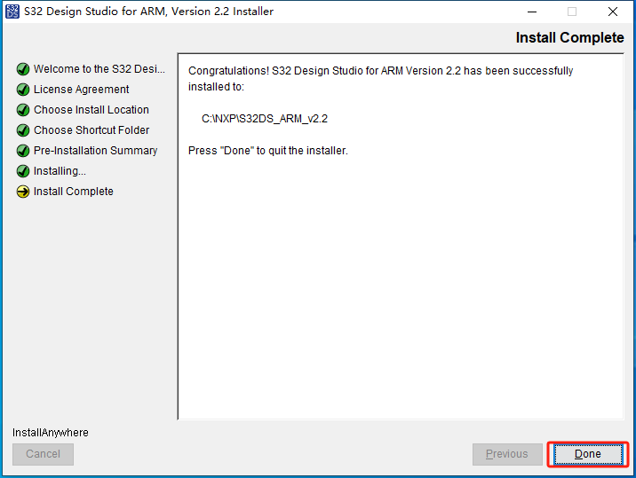

### 更新扩展包
* 安装完成后，打开 “S32 Design Studio”，会出现提示更新扩展包的弹窗。最好把所有的扩展包更新到最新。也可以通过点击 “Help > S32DS Extensions and Updates.” 主动打开更新扩展包的弹窗。如下图所示。

  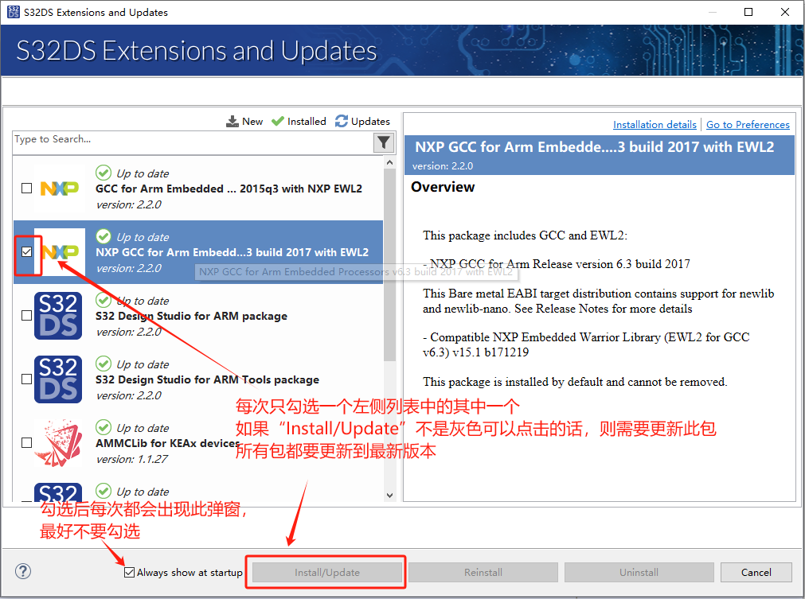

* 更新完成后，重启 “S32 Design Studio”