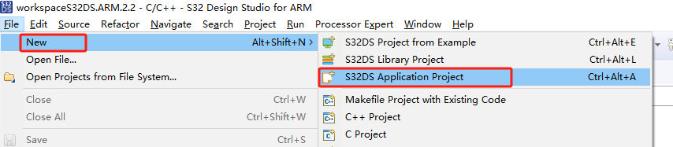
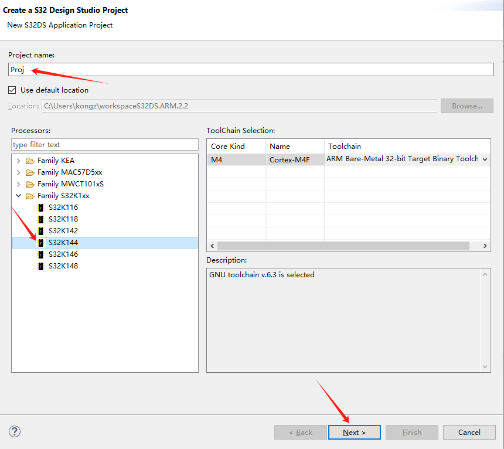
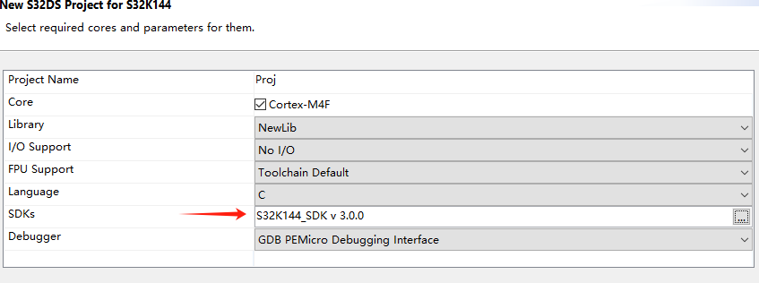
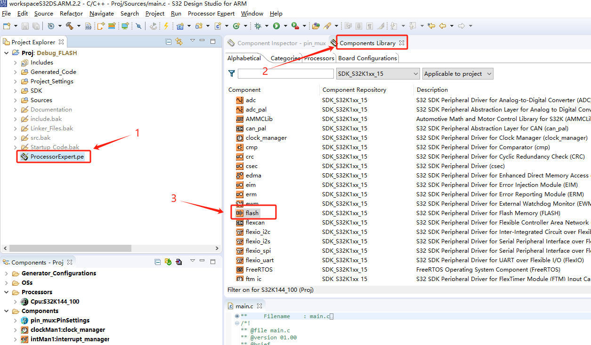
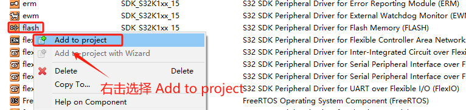
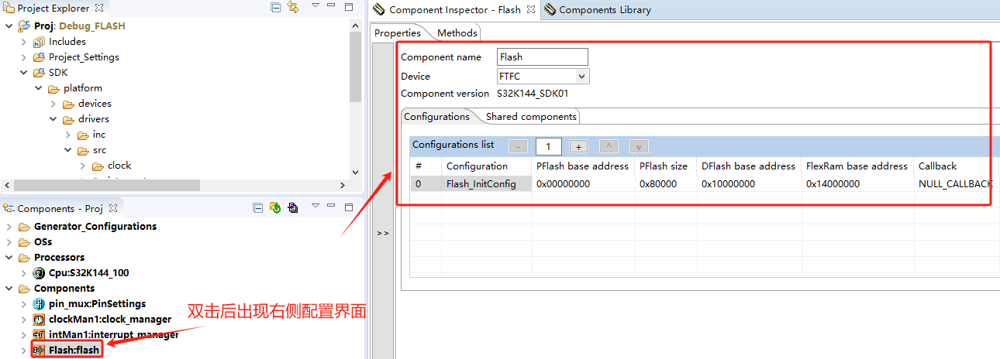
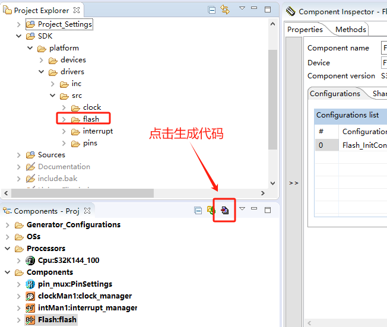
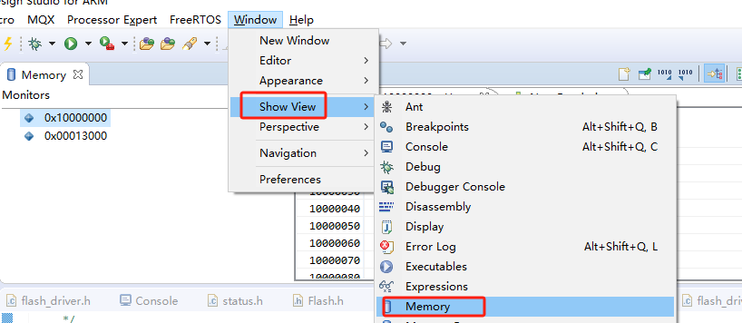
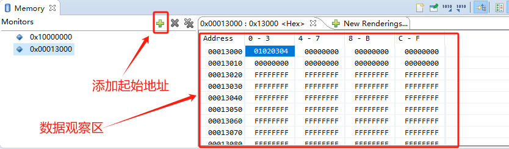

### 准备工作
* 在实现 UDS 诊断刷写之前，还有个准备工作要做，那就是 Flash 驱动。
* 但是按照之前的 [烧录仿真初体验](./烧录仿真初体验.md) 中新建工程方式没有 Flash 驱动的 example。
* 找了一些官方 Demo 程序，发现里面也没有包含 Flash 驱动。经过反复摸索，发现 S32DS 支持通过配置生成外设驱动代码。

### 新建 APP工程
* 按照如下方式，新建 App 工程。
  
  

  

  

### 添加flash驱动
* 按照如下方式，添加 Flash 驱动。

  

  

  

  
* 将 flash_driver.c、flash_driver.h、Flash.c、Flash.h、interrupt_manager.c、interrupt_manager.h、status.h 复制到当前工程中。
* 在 Flash.c 文件中添加如下代码，并在 Flash.h 中向外声明 InitFlash() 函数。

  ```c
  /* Declare a FLASH config struct which initialized by FlashInit, and will be used by all flash operations */
  static flash_ssd_config_t flashSSDConfig;
  
  void InitFlash(void)
  {
      /* Init flash */
  	FLASH_DRV_Init(&Flash_InitConfig, &flashSSDConfig);
  }
  ```
* main() 函数中调用 InitFlash() 初始化 Flash。
* 再封装一个 WriteFlash() 和 EraseFlash() 函数方便使用。代码如下：
  ```c
  status_t WriteFlash(uint32_t startAddr, uint32_t size, const uint8_t * pData)
  {
      status_t ret;
      ret = FLASH_DRV_Program(&flashSSDConfig, startAddr, size, pData);
      return ret;
  }

  status_t EraseFlash(uint32_t startAddr, uint32_t size)
  {
      status_t ret;
      ret = FLASH_DRV_EraseSector(&flashSSDConfig, startAddr, size);
      return ret;
  }
  ```
* ReadFlash() 函数就没必要封装了，因为 Flash 中的数据可以直接通过指针获取到。

### 测试flash驱动
* 简单测试一下 flash 擦除和写入  API 功能是否正常。 
  ```c
  uint8_t testBuf[512] = {0x01, 0x02, 0x03, 0x04};
  volatile unsigned int test_k = 0;
  void FlashTest(void)
  {
      // 擦除所有 D-Flash 区域 - BaseAddr: 0x10000000; Size: 0x10000
      test_k = FLASH_DRV_EraseSector(&flashSSDConfig, 0x10000000, 0x10000);
      // 往 D-Flash 0x10000000 地址处写入数据
      test_k = FLASH_DRV_Program(&flashSSDConfig, 0x10000000, 32, testBuf);
  
      // 擦除 P-Flash - BaseAddr: 0x00013000; Size: 4096
      test_k = FLASH_DRV_EraseSector(&flashSSDConfig, 0x00013000, 4096);
      // 往 P-Flash 0x00013000 地址处写入数据
      test_k = FLASH_DRV_Program(&flashSSDConfig, 0x00013000, 32, testBuf);
  }
  ```
* 调用 FlashTest()，通过 S32DS 可查看数据是否写入 flash，具体如下所示。 

  

  

* APP 和 FBL 程序都需要 flash 驱动，所以这两个程序中都要添加 flash 驱动代码。
* **注意**：
  * P-Flash 擦除时最小单位：4k，写入时最小单位：16 字节
  * D-Flash 擦除时最小单位：2K，写入时最小单位：8 字节