### 新建工程
* S32DS（IDE）已经安装好了，接下来肯定是要找个 Demo 例程熟悉编译、烧录以及 Debug 调试。
* Demo 例程哪里有呢？
* S32DS 支持从 example 中新建工程，具体操作如下所示：

  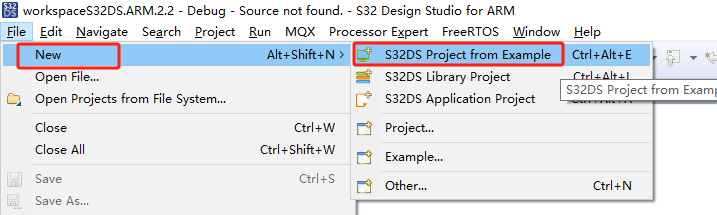

  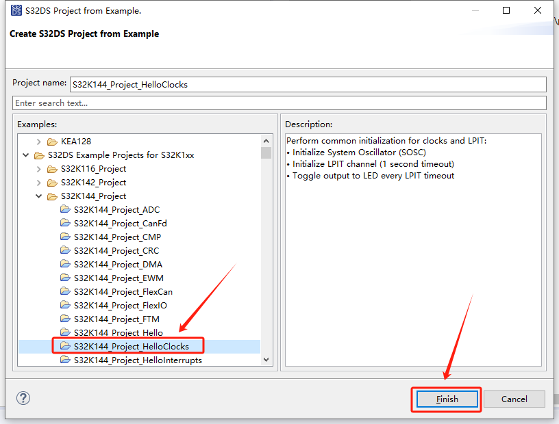
* 此处选择一个 Clock 时钟例程，此工程就作为 Base 基础工程，以后所有开发都是基于此工程实现。
* 改一下工程名

  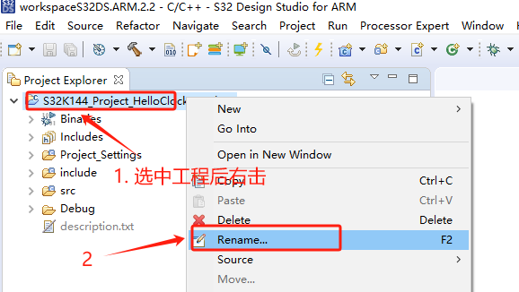

  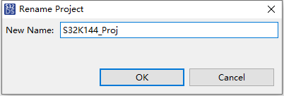
* **注意：新建工程是默认保存在 workspace 中**，默认路径为：C:\Users\xxx(user)\workspaceS32DS.ARM.2.2

### 导入已有工程
* 如果已经有工程了，那么导入已有工程方式如下。

  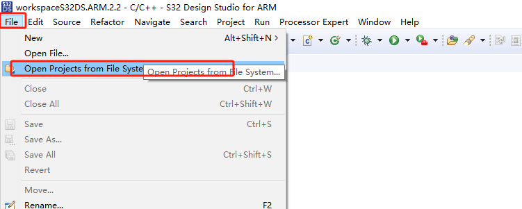

  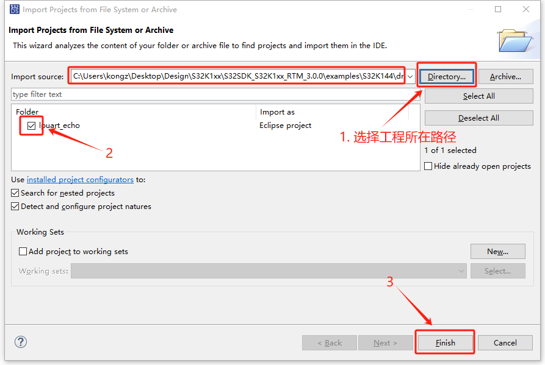

### 编译工程
* 导入工程后，S32DS 会自动生成一些文件，待生成结束后，按如下视图选中工程，进行编译。

  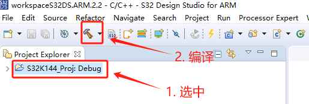
* 从 Console 控制台可以看到编译结果。如下图所示表示编译成功。

  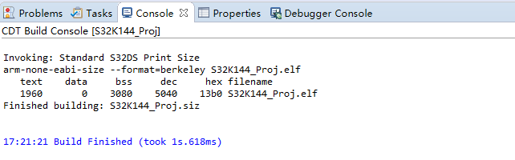

### 硬件连接
* 编译成功后，肯定是要 Debug 仿真运行一下，不过在 Debug 仿真之前需要确保硬件连接 OK。

  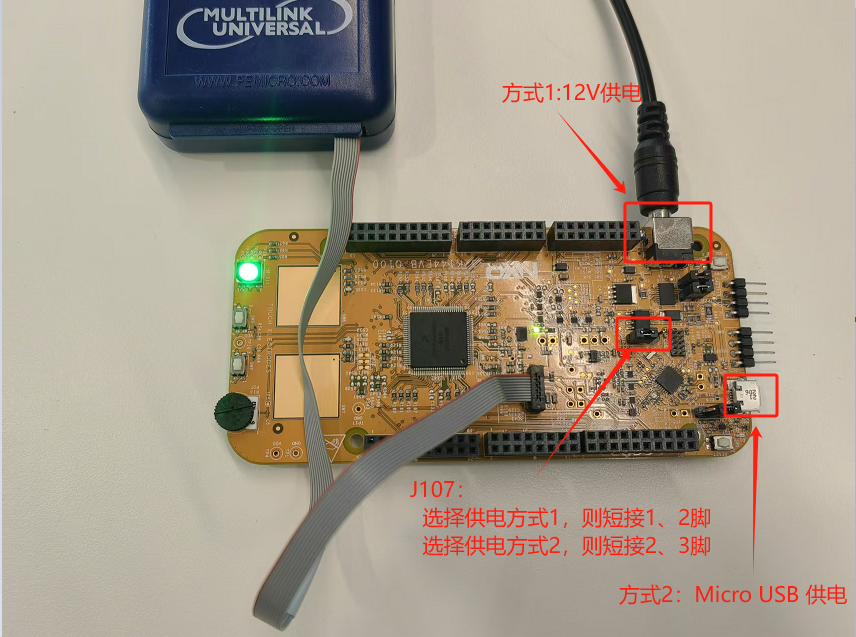

### Debug
* 第一次 Debug 时候需必须进行配置，下图是使用 PE 调试工具配置。

  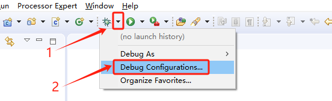

  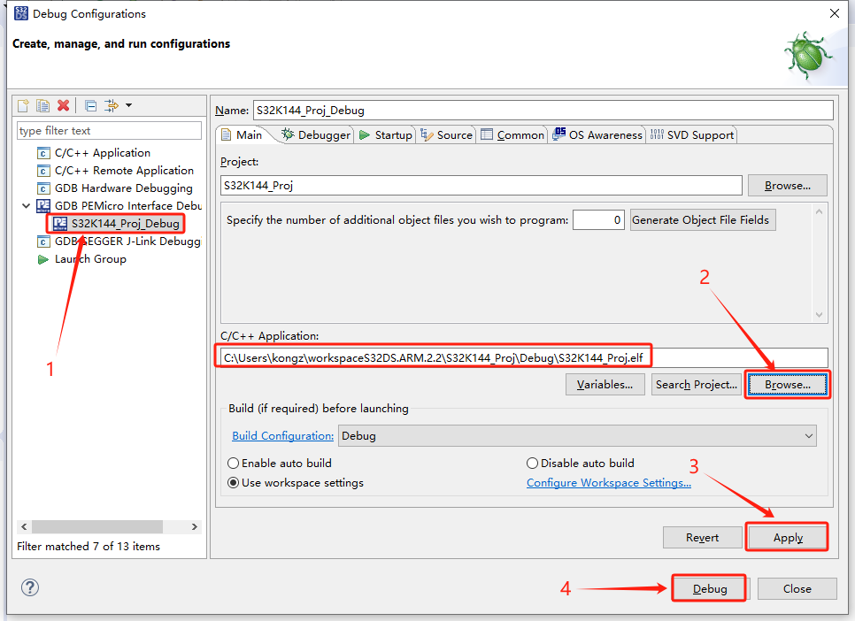
* S32DS 也支持 J-Link 调试，如果使用的是 J-Link 调试工具，则双击 “GDB SEGGER J-Link Debugger”，同上 PE 配置。

  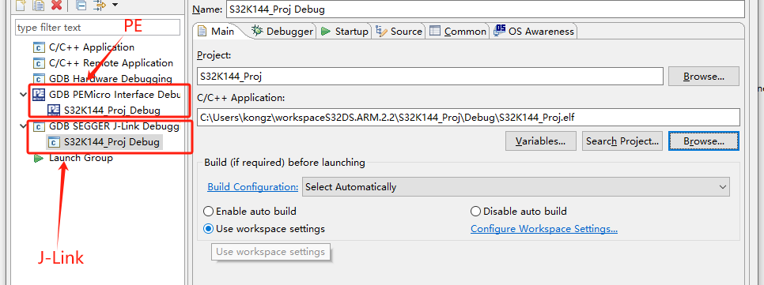

### 添加 .c .h 文件
* 添加 .c .h 文件如下图所示。
* 添加路径是绝对路径，最好改成 “${ProjDirPath}” 前缀，这样工程复制移动到别的位置也不会出错。
* 添加 .c 文件不是指定具体的文件，而是像头文件一样，添加的是路径。而且经过实际测试发现，源文件路径是无限递归的，如添加在 “/S32K144_Proj/src” 这个路径下的所有 .c 文件以及这个目录下再创建的文件夹中的 .c 也会自动默认参与编译。 

  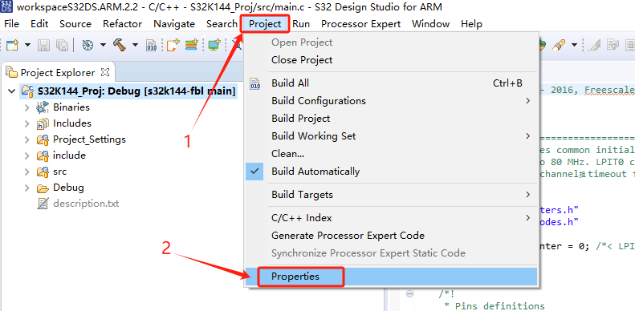

  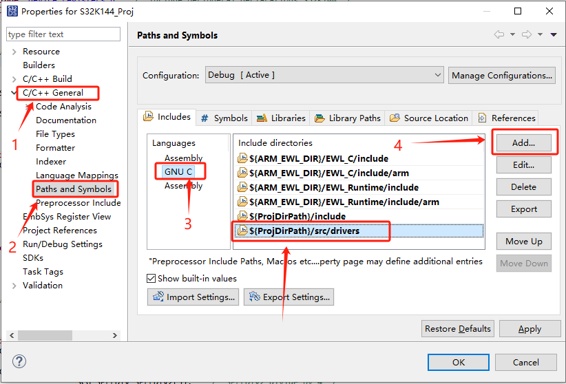

  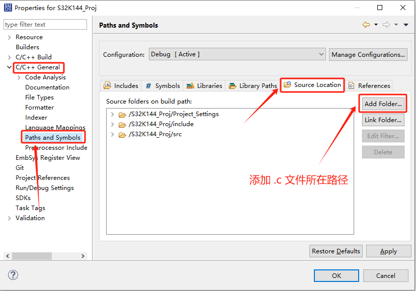

