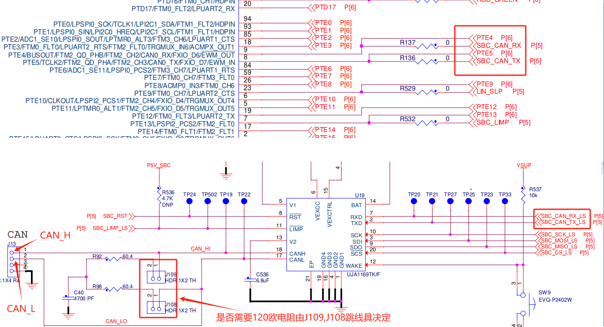
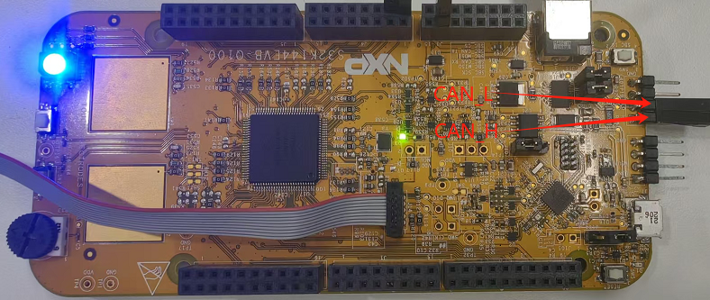
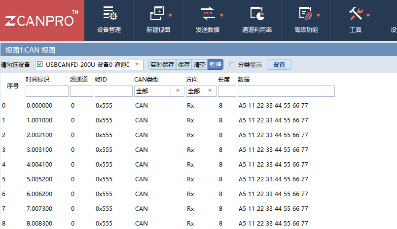
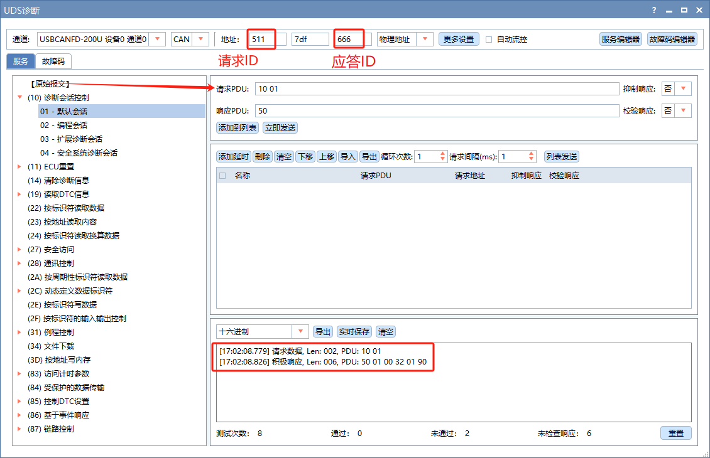

### CAN驱动
* 参考 [烧录仿真初体验](./烧录仿真初体验.md) 中的【新建工程】，从 example 中新建一个 CAN 例程。
* 将 CAN 例程中的驱动代码(FlexCAN.c 和 FlexCAN.h) 复制到当前工程中。这样我们当前工程就有了 CAN 驱动代码。
* 光有串口驱动代码(FlexCAN.c 和 FlexCAN.h)是不够的，注意 CAN 例程中的 PORT_init() 函数中的 CAN Tx、Rx 引脚初始化的代码也要复制到当前工程(S32K144_Proj)中
  ```c
  /*!
	 * Pins definitions
	 * ===================================================
	 *
	 * Pin number        | Function
	 * ----------------- |------------------
	 * PTE4              | CAN0_RX
	 * PTE5              | CAN0_TX
	 */
  PCC->PCCn[PCC_PORTE_INDEX] |= PCC_PCCn_CGC_MASK;	/* Enable clock for PORTE */
  PORTE->PCR[4] |= PORT_PCR_MUX(5);	/* Port E4: MUX = ALT5, CAN0_RX */
  PORTE->PCR[5] |= PORT_PCR_MUX(5); /* Port E5: MUX = ALT5, CAN0_TX */
  ```
* 调用 FLEXCAN0_init() 函数后 CAN 应该就初始化成功了， 在主循环中 1s 周期性调用 FLEXCAN0_transmit_msg() 向外发送 CAN 报文，用于测试 CAN 驱动是否正常工作。
  ```c
  for (;;)
  {	
  	if(0 != (LPIT0->MSR & LPIT_MSR_TIF0_MASK)) // 1ms
  	{
  		static int cnt = 0;
  		if(cnt++ >= 1000)						
  		{
  			cnt = 0;
  			PTD->PTOR |= 1<<0;                	// LED 1000ms 翻转  
  			FLEXCAN0_transmit_msg();
  		}
  		LPIT0->MSR |= LPIT_MSR_TIF0_MASK; /* Clear LPIT0 timer flag 0 */
  	}
  }
  ```
* 一般芯片内部 CAN 外设需要驱动之外，外部还有有个转换芯片也需要驱动，当前评估板用的是  UJA1169TK/F。不过评估板对这颗芯片的使能脚直接做了硬件处理，不是需要软件控制了。

### CAN驱动测试验证
* 参考原理图，找到 CAN 的对外接口是 J13 的 1、2 脚。

  
* 找到评估板的 J13 位置，详细 CAN 接口位置如下图所示：
  
  

* 另一侧接 CAN 调试工具，比如周立功 USBCAN 或者 CANoe。关于这两种工具的详细使用说明，可参考：
  * ZCANPRO工具软件使用教程: https://gitee.com/openes/zcanpro
  * CANoe工具软件基础使用教程: https://gitee.com/openes/canoe
* 这里使用周立功的 CAN 调试工具，结果如下图所示，成功收到板子发出的 CAN 数据。
  
  

### 重写CAN收发接口函数
* 由于示例代码 CAN 驱动中的发送函数是发送固定的数据，我们要将其改成能发送任意数据的接口函数。代码实现如下：  
  ```c
  #if 0
  void FLEXCAN0_transmit_msg(void)
  {
  	/*! Assumption:
  	 * =================================
  	 * Message buffer CODE is INACTIVE
  	 */
  	CAN0->IFLAG1 = 0x00000001;	/* Clear CAN 0 MB 0 flag without clearing others*/
  
    CAN0->RAMn[ 0*MSG_BUF_SIZE + 2] = 0xA5112233;	/* MB0 word 2: data word 0 */
    CAN0->RAMn[ 0*MSG_BUF_SIZE + 3] = 0x44556677; /* MB0 word 3: data word 1 */
  #ifdef NODE_A
    CAN0->RAMn[ 0*MSG_BUF_SIZE + 1] = 0x15540000; /* MB0 word 1: Tx msg with STD ID 0x555 */
  #else
    CAN0->RAMn[ 0*MSG_BUF_SIZE + 1] = 0x14440000; /* MB0 word 1: Tx msg with STD ID 0x511 */
  #endif
    CAN0->RAMn[ 0*MSG_BUF_SIZE + 0] = 0x0C400000 | 8 << CAN_WMBn_CS_DLC_SHIFT;
    	  	  	  	  	  	  	  	  	  	  	  	/* MB0 word 0: 								*/
                                                  /* EDL,BRS,ESI=0: CANFD not used 				*/
                                                  /* CODE=0xC: Activate msg buf to transmit 		*/
                                                  /* IDE=0: Standard ID 							*/
                                                  /* SRR=1 Tx frame (not req'd for std ID) 		*/
                                                  /* RTR = 0: data, not remote tx request frame	*/
                                                  /* DLC = 8 bytes 								*/
  }
  #endif
  void FLEXCAN0_transmit_msg(uint32_t id, uint8_t* buf, uint8_t dlc)
  {
    CAN0->IFLAG1 = 0x00000001;
    CAN0->RAMn[ 0*MSG_BUF_SIZE + 1] = id << 18;
    CAN0->RAMn[ 0*MSG_BUF_SIZE + 2] = buf[0] << 24 | buf[1] << 16 | buf[2] << 8 | buf[3];
    CAN0->RAMn[ 0*MSG_BUF_SIZE + 3] = buf[4] << 24 | buf[5] << 16 | buf[6] << 8 | buf[7];
    CAN0->RAMn[ 0*MSG_BUF_SIZE + 0] = 0x0C400000 | dlc << CAN_WMBn_CS_DLC_SHIFT;
  }
  ```
* 由于示例代码中的 CAN 接收并不是中断模式，而是轮询方式，所以要把 FLEXCAN0_receive_msg() 放到主循环中调用。另外找到接收中断标志寄存器(CAN0->IFLAG1 bit4)，在没有收到数据时直接跳出函数，节省算力。
  ```c
  #if 0
  void FLEXCAN0_receive_msg(void)
  {
  /*! Receive msg from ID 0x556 using msg buffer 4
   * =============================================
   */
    uint8_t j;
    uint32_t dummy;
  
    RxCODE   = (CAN0->RAMn[ 4*MSG_BUF_SIZE + 0] & 0x07000000) >> 24;	/* Read CODE field */
    RxID     = (CAN0->RAMn[ 4*MSG_BUF_SIZE + 1] & CAN_WMBn_ID_ID_MASK)  >> CAN_WMBn_ID_ID_SHIFT;	/* Read ID 			*/
    RxLENGTH = (CAN0->RAMn[ 4*MSG_BUF_SIZE + 0] & CAN_WMBn_CS_DLC_MASK) >> CAN_WMBn_CS_DLC_SHIFT;	/* Read Message Length */
  
    for (j=0; j<2; j++)
    {  /* Read two words of data (8 bytes) */
      RxDATA[j] = CAN0->RAMn[ 4*MSG_BUF_SIZE + 2 + j];
    }
    RxTIMESTAMP = (CAN0->RAMn[ 0*MSG_BUF_SIZE + 0] & 0x000FFFF);
    dummy = CAN0->TIMER;             /* Read TIMER to unlock message buffers */
    CAN0->IFLAG1 = 0x00000010;       /* Clear CAN 0 MB 4 flag without clearing others*/
  }
  #endif
  void FLEXCAN0_receive_msg(void)
  {
    uint8_t j;
  
    // 未接收到消息，直接退出
    if (0 == ((CAN0->IFLAG1 >> 4) & 1))
      return;
  
    RxCODE   = (CAN0->RAMn[ 4*MSG_BUF_SIZE + 0] & 0x07000000) >> 24;	/* Read   CODE field */
    RxID     = (CAN0->RAMn[ 4*MSG_BUF_SIZE + 1] & CAN_WMBn_ID_ID_MASK)  >>   CAN_WMBn_ID_ID_SHIFT;	/* Read ID 			*/
    RxLENGTH = (CAN0->RAMn[ 4*MSG_BUF_SIZE + 0] & CAN_WMBn_CS_DLC_MASK) >>   CAN_WMBn_CS_DLC_SHIFT;	/* Read Message Length */
  
    // 读取 8 个字节数据到 RxDATA[] 中
    for (j=0; j<2; j++)
    {  
      RxDATA[j] = CAN0->RAMn[ 4*MSG_BUF_SIZE + 2 + j];
    }
    RxTIMESTAMP = (CAN0->RAMn[ 0*MSG_BUF_SIZE + 0] & 0x000FFFF);
    CAN0->IFLAG1 = 0x00000010;       /* Clear CAN 0 MB 4 flag without   clearing others*/
  }
  ```
* 注意：从 CAN 初始化函数中可以看出，CAN 的 ID 过滤器设置为 0x511(0x14440000>>18)，所以仅能收到 ID 为 0x511 的 CAN 消息。

### 异常问题解决
* 按照上面方式，分别在 APP 和 FBL 程序中添加 CAN 驱动代码。
* 分别独立测试 APP 和 FBL 的 CAN 驱动，收发正常，但是，当合并 APP 和 FBL 程序后发现，FBL 程序能正常运行，但是跳转到 APP 后，APP 程序却无法正常运行。
* 分析查找原因，发现 CAN 初始化函数 FLEXCAN0_init() 不可以多次调用。
* 这主要是由于示例的 CAN 驱动程序写的太烂，应该先 DeInit，再 Init。这里我懒得改，直接把 APP 中的 CAN 初始化代码注释掉。保留 FBL 中的 CAN 初始化即可，其它收发函数不变。

### 移植 UDS 诊断协议栈
* 参考：https://gitee.com/openes/uds
* UDS诊断栈代码复制过来后，先对接收发接口
  ```c
  void FLEXCAN0_receive_msg(void)
  {
    ...
    // 读取 8 个字节数据到 frameBuf[] 中
    static uint8_t frameBuf[8];
    frameBuf[0] = CAN0->RAMn[ 4*MSG_BUF_SIZE + 2 + 0] >> 24;
    frameBuf[1] = CAN0->RAMn[ 4*MSG_BUF_SIZE + 2 + 0] >> 16;
    frameBuf[2] = CAN0->RAMn[ 4*MSG_BUF_SIZE + 2 + 0] >> 8;
    frameBuf[3] = CAN0->RAMn[ 4*MSG_BUF_SIZE + 2 + 0] >> 0;
    frameBuf[4] = CAN0->RAMn[ 4*MSG_BUF_SIZE + 2 + 1] >> 24;
    frameBuf[5] = CAN0->RAMn[ 4*MSG_BUF_SIZE + 2 + 1] >> 16;
    frameBuf[6] = CAN0->RAMn[ 4*MSG_BUF_SIZE + 2 + 1] >> 8;
    frameBuf[7] = CAN0->RAMn[ 4*MSG_BUF_SIZE + 2 + 1] >> 0;
    uds_recv_frame(RxID>>18, frameBuf, RxLENGTH);
    ...
  }

  #include "FlexCAN.h"
  void uds_send_frame(uint32_t response_id, uint8_t* frame_buf, uint8_t frame_dlc)
  {
    FLEXCAN0_transmit_msg(response_id, frame_buf, frame_dlc);
  }
  ```
* 之后就是调用 uds_init() 函数初始并 1ms 周期性调用 uds_1ms_task() 函数。
* 将 UDS诊断栈代码分别移植到 APP 和 FBL 中并测试，发送一个简单的切换到默认会话命令，验证其响应是否 OK。

  